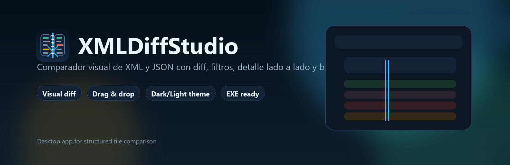
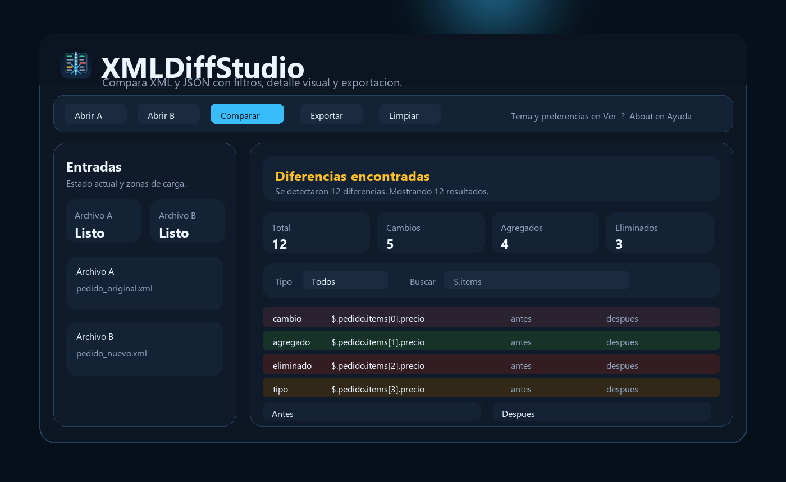

# XMLDiffStudio



Aplicacion de escritorio para comparar archivos `XML` y `JSON` con una interfaz visual pensada para detectar cambios de estructura y valores mas rapido.

## Que hace

- Compara `XML` contra `XML`
- Compara `JSON` contra `JSON`
- Detecta cambios, nodos agregados, eliminados y cambios de tipo
- Preserva mejor `namespaces`, contenido mixto y listas repetidas
- Muestra diferencias con filtros, busqueda y colores por tipo
- Abre detalle lado a lado de `Antes` y `Despues`
- Permite arrastrar y soltar archivos sobre `Archivo A` y `Archivo B`
- Exporta reportes a `TXT`, `CSV` y `JSON`
- Recuerda preferencias, tema, rutas recientes y estado de ventana
- Incluye build listo para `.exe`

## Vista general

La app esta pensada para revisar diferencias de configuracion, integraciones, payloads o documentos estructurados sin pelearte con archivos enormes en texto plano.



Incluye:

- resumen visual por tipo de diferencia
- tabla con resaltado por cambio
- detalle comparativo lado a lado
- comparacion en segundo plano para no congelar la interfaz
- tema claro y oscuro
- splash screen e icono propio

## Ejecutar en desarrollo

```powershell
python -m venv .venv
.\.venv\Scripts\Activate.ps1
pip install -r requirements.txt
python .\XMLDiffStudio.py
```

## Pruebas

```powershell
.\.venv\Scripts\python.exe -m unittest discover -s tests -v
```

## Generar EXE

```powershell
.\build.ps1
```

Salida esperada:

```text
dist/XMLDiffStudio/XMLDiffStudio.exe
```

## Estructura

- `XMLDiffStudio.py`: punto de entrada
- `xmldiffstudio/app.py`: interfaz, eventos y experiencia de escritorio
- `xmldiffstudio/diff_engine.py`: motor de comparacion
- `xmldiffstudio/config.py`: persistencia de configuracion
- `tests/`: pruebas automatizadas
- `assets/`: icono y recursos visuales

## Assets

- Icono principal: `assets/xmldiffstudio-icon.ico`
- Vista previa: `assets/xmldiffstudio-icon.png`

## Version actual

`v0.2.0`
